<!--
  ─────────────────────────────────────────────────────────────
  MKishoreDev · GitHub profile README
  A late-night lo-fi coding workspace, rendered in markdown.
  All visuals live in ./assets and use one shared palette.
  ─────────────────────────────────────────────────────────────
-->

<!-- ══════════════════════════════════  HERO  ═════════════════════════════════ -->

 

 

&nbsp;

&nbsp;

&nbsp;

<!-- ══════════════════════════════════  ABOUT  ══════════════════════════════════ -->

## &nbsp;About

> A student developer from **Tirunelveli, Tamil Nadu**, building software in the small hours between school and sleep.

Started with **Telegram bots** during the **2021 lockdown** — built one that eventually scaled to **10,000+ groups**.

Went deep into backend development in **2024**, and now building **web apps, APIs, automation tools, SDKs, and open-source projects** while balancing **Class 12**.

Most of my work lives in public repositories — from developer tools and backend systems to experiments, automation, and open-source software.

<table>
  <tr>
    <td>📍</td><td><b>Tirunelveli</b>, Tamil Nadu, India</td>
    <td>&nbsp;&nbsp;&nbsp;</td>
    <td>🎓</td><td><b>Class 12</b> · Computer Science</td>
  </tr>
  <tr>
    <td>💻</td><td>Building <b>in public</b></td>
    <td></td>
    <td>☕</td><td>Fueled by <b>curiosity &amp; caffeine</b></td>
  </tr>
</table>

<!-- ══════════════════════════════════  JOURNEY  ══════════════════════════════════ -->

## &nbsp;Journey

&nbsp;view as table

| year | milestone |
|:---:|:---|
| **2021** | Started exploring Telegram bots during lockdown |
| **2021 – 2023** | Built **SerenaRobot** → scaled to **10,000+ groups** |
| **2023 – 2024** | Deep dive into Python, databases &amp; software engineering |
| **2024** | Shifted focus toward backend architecture &amp; APIs |
| **2025** | Chose Computer Science stream after 10th boards |
| **2026 →** | Building full-stack products, SDKs &amp; OSS in public |

<!-- ══════════════════════════════════  TECH STACK  ═════════════════════════════════ -->

## &nbsp;Tech Stack

<table>
<tr><td valign="top" width="50%">

**Languages**

**Backend & APIs**

**Databases**

</td><td valign="top" width="50%">

**AI & Integrations**

**Tools & Deployment**

**Currently learning**

- **DSA** → strengthening fundamentals through problem solving
- **Aptitude & Reasoning** → quantitative analysis &amp; logical problem-solving
- **System Design** → scalable backend architecture
- **Open Source at Scale** → contribution workflows &amp; maintenance

</td></tr>
</table>

<!-- ══════════════════════════════════  RECENT WRITING  ═══════════════════════════════ -->

## &nbsp;Recent Writing

<!-- BLOGS:START -->
<table width="100%" style="border-collapse: collapse; border: none;">
  <tr style="border: none;">
    <td width="33.3%" align="center" style="border: none; padding: 0;">
      
    </td>
    <td width="33.3%" align="center" style="border: none; padding: 0;">
      
    </td>
    <td width="33.3%" align="center" style="border: none; padding: 0;">
      
    </td>
  </tr>
</table>

  <i>Looking for more? Click <b><a href="https://mkishore.is-a.dev/blogs/">here</a></b> to view all blogs at <b><a href="https://mkishore.is-a.dev/blogs/">mkishore.is-a.dev/blogs</a></b>.</i>

<!-- BLOGS:END -->

<!-- ══════════════════════════════════  COMMITS  ═════════════════════════════════ -->

## &nbsp;Recent Activity

  <i>click the card above to view raw commit history</i>

<!-- ══════════════════════════════════  STATS  ═════════════════════════════════ -->

## &nbsp;Stats

<!-- GitHub Stats Row -->

  
  

<!-- Streak Stats -->

  

<!-- Activity Graph -->

  

<!-- Trophy Stats -->

  

<!-- Snake Contribution Graph -->

  

<!-- ══════════════════════════════════  QUOTE  ═════════════════════════════════ -->

<!--
  Live quote card — served by api/quote.js on your Vercel project.
  Replace the URL with your own deployment (e.g. https://mkishore.is-a.dev/api/quote.svg).
  The static fallback (./assets/quote.svg) is kept so the README still looks
  good if the endpoint is ever offline.
-->

<!-- ══════════════════════════════════  ELSEWHERE  ═════════════════════════════════ -->

## &nbsp;Elsewhere

<table>
<tr>
<td align="center" width="20%">
<a href="https://mkishore.is-a.dev">
 
<b>website</b> 
mkishore.is-a.dev
</a>
</td>
<td align="center" width="20%">
<a href="https://linkedin.com/in/mkishore-dev">
 
<b>linkedin</b> 
mkishore-dev
</a>
</td>
<td align="center" width="20%">
<a href="https://github.com/MKishoreDev">
 
<b>github</b> 
@MKishoreDev
</a>
</td>
<td align="center" width="20%">
<a href="mailto:kishoredxd@gmail.com">
 
<b>email</b> 
kishoredxd@gmail.com
</a>
</td>
<td align="center" width="20%">
<a href="https://t.me/KishoreDxD">
 
<b>telegram</b> 
@KishoreDxD
</a>
</td>
</tr>
</table>

 
<i>looking for other social links (instagram, discord, x, etc.)? find them all on my <b><a href="https://mkishore.is-a.dev">portfolio website</a></b>.</i>

 

